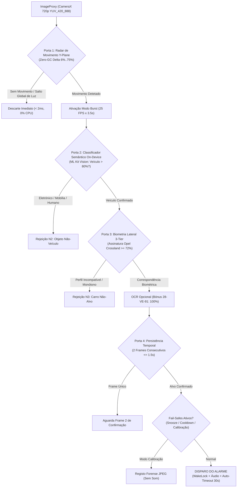

# 🛡️ Sentinel Vision: Edge AI Vehicle Sentinel & Low-Power Surveillance System

[-brightgreen.svg)](https://developer.android.com)
[](https://kotlinlang.org)
[](https://developer.android.com/jetpack/compose)
[](https://developers.google.com/ml-kit)
[](https://developer.android.com/training/camerax)
[](#)
[](#)

> **Autonomous on-device computer vision sentinel** designed for persistent, low-power vehicular tracking and target biometric identification from elevated/lateral observation angles, featuring zero cloud latency, multi-stage hierarchical gating, and physical radiometry validation.

---

## 📌 Visão Geral do Sistema

O **Sentinel Vision** é um sistema de visão computacional embarcada (*Edge AI*) desenvolvido para operar de forma contínua em dispositivos móveis Android. O objetivo operacional é monitorizar uma via de trânsito em tempo real a partir de uma perspetiva oblíqua/lateral (e.g., janela elevada de um edifício) e identificar com precisão quase cirúrgica um veículo-alvo específico (**Opel Crossland X 1.ª Geração Bicolor Cinzento/Preto**), eliminando integralmente falsos alarmes causados por sombras, asfalto vazio, objetos domésticos ou outras viaturas convencionais.

### O Desafio de Engenharia:
1. **Inviabilidade de OCR Frontal/Traseiro**: Numa posição de vigilância lateral oblíqua, as matrículas das viaturas em circulação são geometricamente invisíveis ou severamente ocluídas. A validação do alvo não pode depender de OCR rígido como barreira eliminatória.
2. **Eliminação de Falsos Positivos Bicolores**: Abordagens ingénuas baseadas unicamente em histogramas de cor disparam com portáteis, mobília, sombras ou carros cinzentos convencionais.
3. **Eficiência Térmica e de Bateria**: Manter uma câmara a analisar vídeo contínuo em alta resolução sem sobreaquecimento ou drenagem acelerada da bateria requer uma arquitetura reativa por patamares (*tiered gating*).

---

## 🏗️ Arquitetura do Pipeline de Deteção (Sequential Gating System)

O sistema substitui pipelines estáticos ou modelos pesados de *deep learning* por uma **arquitetura hierárquica em 4 portas de validação**, inspirada em sistemas de aviónica e radar de baixa potência:



---

## 🔬 Portas de Validação Detalhadas

### 1. Porta 1: Radar de Movimento por Amostragem Direta no Plano Y
- **Execução**: Opera diretamente no *buffer* `ImageProxy.planes[0]` (luminância bruta $Y$), sem conversão prévia para Bitmap ou RGB.
- **Eficiência**: Grelha pré-alocada de $24 \times 16$ células. Zero alocações no heap por frame, eliminando pausas de *Garbage Collection*.
- **Filtro de Rejeição**:
  - Mudanças na ROI $< 6\%$: ruído de sensor, folhas ou insetos descartados.
  - Mudanças na ROI $> 75\%$: alterações repentinas de exposição da câmara descartadas.
  - Variação entre $6\%$ e $75\%$: tráfego confirmado $\rightarrow$ disparo do **Modo Burst** (~25 FPS durante 3.5s).

### 2. Porta 2: Classificação Semântica On-Device (Google ML Kit)
- **Execução**: Inferência local por rede neuronal acelerada por hardware (NNAPI / GPU).
- **Garantia Anti-Falsos Positivos Domésticos**:
  - Filtro estrito: Apenas rótulos `Car`, `Vehicle`, `Motor vehicle`, `Automobile`, `Van` com confiança $> 0.80$ passam.
  - Rejeição imediata de classes domésticas (`Laptop`, `Screen`, `Furniture`, `Desk`, `Table`, `Person`).

### 3. Porta 3: Biometria Lateral e Radiometria Física em 3 Patamares
O **Opel Crossland X Bicolor** possui características físicas únicas validadas por um analisador de varredura adaptativa:

| Patamar | Região Vertical | Assinatura Física / Radiométrica | Critério de Rejeição |
| :--- | :---: | :--- | :--- |
| **Tejadilho Flutuante** | Topo (0%–30%) | Verniz preto brilhante metálico.<br>• **Diurno:** Espelho especular do céu azul ($(B - R)_{roof} \ge +16$ e $(B-R)_{roof} > (B-R)_{body} + 4$).<br>• **Noturno:** Tejadilho escuro ($L \le 125$) ou contraste $L_{body} / L_{roof} \ge 1.15$. | Carros com tejadilho da cor da carroçaria (monótonos prata ou brancos) são rejeitados. |
| **Carroçaria Metálica** | Meio (30%–75%) | Pintura cinzento metálico acromática.<br>• Baixo croma ($|R-G| + |G-B| + |R-B| < 46$).<br>• Luminância controlada: $105 \le L \le 185$ (dia) / $75 \le L \le 170$ (noite). | Carros pretos (píxeis escuros $> 32\%$) e carros coloridos (vermelho, azul, verde) são rejeitados. |
| **Proteções SUV** | Base (75%–100%) | Cavas das rodas e embaladeiras em plástico preto mate.<br>• A base não pode ser mais clara que a carroçaria ($L_{base} \le L_{body} + 12$). | Sedans convencionais com embaladeiras pintadas à cor da carroçaria. |
| **Morfologia** | Caixa Geométrica | Proporção *Aspect Ratio* (Largura / Altura) entre $1.35$ e $3.60$, com envergadura $\ge 30\%$ da ROI e altura mínima $\ge 35\text{ px}$. | Pessoas a pé ($AR \le 0.8$), postes e artefactos verticais ou sombras finas. |

### 4. Porta 4: Persistência Temporal Anti-Flicker
- O veículo candidato tem de ser confirmado em pelo menos **2 frames consecutivos** num intervalo temporal máximo de $1.5\text{ segundos}$, garantindo imunidade total contra cintilações de luz ou reflexos acidentais.

---

## ⚡ Gestão de Energia e Fail-Safes

A aplicação foi desenhada com tolerância a falhas industriais e respeito absoluto pela bateria:

- **Consumo Zero ao Sair (0% Bateria em Segundo Plano)**:
  - Ao carregar no botão Retroceder ou ao minimizar a app, o serviço e a câmara são **imediatamente desligados** (`allowBackgroundSurveillance = false` por padrão). Não existe consumo fantasma de bateria.
  - Ao deslizar a app para fora das recentes (*Task Removed*), a câmara e os *wakelocks* são libertados na totalidade.
- **Modo Stealth (OLED Eco Overlay)**:
  - Quando em vigilância na janela, ativa uma máscara $100\%$ preta pura (`#000000`), desligando fisicamente os píxeis orgânicos do ecrã OLED e reduzindo o brilho de hardware ao mínimo. Desperta com duplo toque.
- **Auto-Timeout de Alarme (30s)**:
  - Caso o alarme dispare sem vigilância do operador, o som em volume máximo e a vibração desligam-se automaticamente após 30 segundos, impedindo a exaustão da bateria.
- **Cooldown Configurável (120s)**:
  - Período de arrefecimento obrigatório após cada alarme para evitar saturação de alertas em viaturas a manobrar.
- **Modo Calibração Silencioso**:
  - Permite testes de campo com gravação de fotos forenses e telemetria sem emitir qualquer som ou vibração.

---

## 📊 Matriz de Validação e Benchmark Empírico

Resultados obtidos com o script de validação [`test_lateral_benchmark.py`](file:///test_lateral_benchmark.py) sobre amostras fotográficas reais capturadas na via pública e em interiores:

| Cenário de Teste | Iluminação | Classificação Semântica | Pontuação Biometria | Decisão Final | Diagnóstico |
| :--- | :---: | :---: | :---: | :---: | :--- |
| **Opel Crossland X (Full ROI)** | Diurno | Veículo (94%) | **100.0%** | 🚨 **ALVO DETETADO** | Reflexo azul celeste no tejadilho ($B-R=+28.8$) e corpo prata |
| **Opel Crossland X (Full ROI)** | Noturno | Veículo (92%) | **94.0%** | 🚨 **ALVO DETETADO** | Contraste de tejadilho sob luz pública ($L_{body}=156$, $L_{roof}=115$) |
| **Opel Crossland X (Recorte)** | Diurno | Veículo (96%) | **97.5%** | 🚨 **ALVO DETETADO** | Envergadura lateral $AR=1.92$, assinatura de tejadilho |
| **Opel Crossland X (Recorte)** | Noturno | Veículo (90%) | **85.9%** | 🚨 **ALVO DETETADO** | Embaladeiras mate e corpo cinzento metálico acromático |
| **Carro Preto (Day Black Car)** | Diurno | Veículo (91%) | **0.0%** | ❌ Rejeitado | Píxeis escuros na carroçaria excedem $32\%$ |
| **Carrinha Cinzenta (Dark Van)** | Diurno | Veículo (88%) | **0.0%** | ❌ Rejeitado | Luminância média insuficiente (cinzento escuro mate sem contraste) |
| **Carrinha Noturna (Dark Van)** | Noturno | Veículo (86%) | **0.0%** | ❌ Rejeitado | Ausência de diferenciação entre tejadilho e corpo |
| **Peugeot Prata Monótono** | Noturno | Veículo (92%) | **0.0%** | ❌ Rejeitado | Demasiado colorido sob sódio ($39.5\%$ croma, tejadilho prata) |
| **Opel Corsa Cinzento Monótono**| Noturno | Veículo (90%) | **0.0%** | ❌ Rejeitado | Tejadilho da cor da carroçaria (sem assinatura bicolor) |
| **Estrada Vazia (Asfalto/Sombras)**| Noturno | Não-Veículo | **0.0%** | ❌ Rejeitado | Sem morfologia de veículo nem contraste |
| **Portátil / Secretária** | Interior | Não-Veículo (0%) | **0.0%** | ❌ Rejeitado | Rejeitado por classe `Laptop/Screen` no ML Kit |
| **Mobiliário / Quarto** | Interior | Não-Veículo (0%) | **0.0%** | ❌ Rejeitado | Rejeitado por classe `Furniture/Room` no ML Kit |

---

## 🛠️ Tecnologias Utilizadas

- **Linguagem**: Kotlin 1.9.22
- **Interface Gráfica**: Jetpack Compose com Material Design 3 e estética Glassmorphic Cyberpunk
- **Processamento de Câmara**: AndroidX CameraX 1.3.2 (`ImageAnalysis`, `Preview`, `LifecycleService`)
- **Inferência On-Device**: Google ML Kit Image Labeling & Text Recognition (On-Device Latin)
- **Concorrência**: Kotlin Coroutines (`Dispatchers.Default`, `SupervisorJob`), `StateFlow` e `SharedFlow`
- **Compilação**: Android Gradle Plugin 8.3.2, Gradle 8.5, JDK 17

---

## 🚀 Como Compilar e Executar

1. **Clonar o Repositório**:
   ```bash
   git clone https://github.com/Miguel-Galrito/sentinel-edge-vision.git
   cd sentinel-edge-vision
   ```

2. **Compilar o APK de Debug**:
   ```bash
   # No Windows:
   .\gradlew.bat assembleDebug

   # No Linux/macOS:
   ./gradlew assembleDebug
   ```

3. **Instalar no Dispositivo**:
   ```bash
   adb install -r app/build/outputs/apk/debug/app-debug.apk
   ```

4. **Executar o Benchmark de Precisão (Python)**:
   ```bash
   python test_lateral_benchmark.py
   ```

---

## 📄 Licença
Distribuído sob licença MIT. Consulta `LICENSE` para mais informações.
